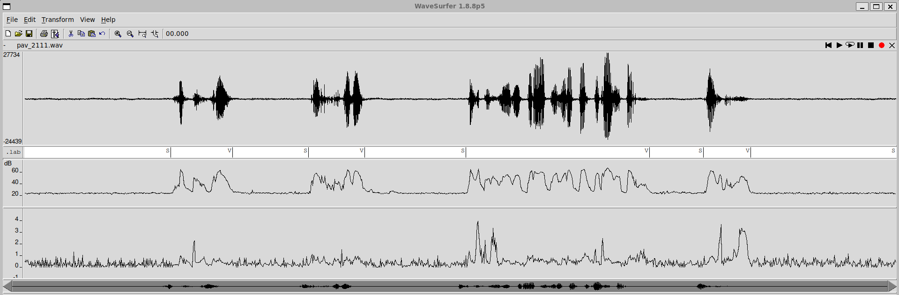
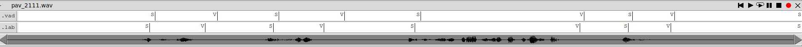
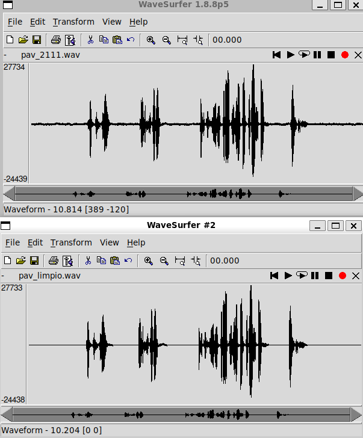
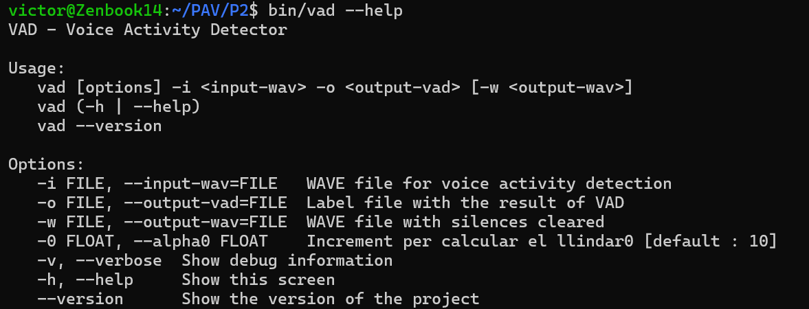

PAV - P2: detección de actividad vocal (VAD)  -- Aaron Noguera, Victor Andreu
============================================

Esta práctica se distribuye a través del repositorio GitHub [Práctica 2](https://github.com/albino-pav/P2),
y una parte de su gestión se realizará mediante esta web de trabajo colaborativo.  Al contrario que Git,
GitHub se gestiona completamente desde un entorno gráfico bastante intuitivo. Además, está razonablemente
documentado, tanto internamente, mediante sus [Guías de GitHub](https://guides.github.com/), como
externamente, mediante infinidad de tutoriales, guías y vídeos disponibles gratuitamente en internet.


Inicialización del repositorio de la práctica.
----------------------------------------------

Para cargar los ficheros en su ordenador personal debe seguir los pasos siguientes:

*  Abra una cuenta GitHub para gestionar esta y el resto de prácticas del curso.
*  Cree un repositorio GitHub con el contenido inicial de la práctica (sólo debe hacerlo uno de los
  integrantes del grupo de laboratorio, cuya página GitHub actuará de repositorio central del grupo):
  -  Acceda la página de la [Práctica 2](https://github.com/albino-pav/P2).
  -  En la parte superior derecha encontrará el botón **`Fork`**. Apriételo y, después de unos segundos,
    se creará en su cuenta GitHub un proyecto con el mismo nombre (**P2**). Si ya tuviera uno con ese 
    nombre, se utilizará el nombre **P2-1**, y así sucesivamente.
*  Habilite al resto de miembros del grupo como *colaboradores* del proyecto; de este modo, podrán
  subir sus modificaciones al repositorio central:
  -  En la página principal del repositorio, en la pestaña **:gear:`Settings`**, escoja la opción 
    **Collaborators** y añada a su compañero de prácticas.
  -  Éste recibirá un email solicitándole confirmación. Una vez confirmado, tanto él como el
    propietario podrán gestionar el repositorio, por ejemplo: crear ramas en él o subir las
    modificaciones de su directorio local de trabajo al repositorio GitHub.
*  En la página principal del repositorio, localice el botón **Branch: master** y úselo para crear
  una rama nueva con los primeros apellidos de los integrantes del equipo de prácticas separados por
  guion (**fulano-mengano**).
*  Todos los miembros del grupo deben realizar su copia local en su ordenador personal.
  -  Copie la dirección de su copia del repositorio apretando en el botón **Clone or download**.
    Asegúrese de usar *Clone with HTTPS*.
  -  Abra una sesión de Bash en su ordenador personal y vaya al directorio **PAV**. Desde ahí, ejecute:

    ```.sh
    git clone dirección-del-fork-de-la-práctica
    ```

  -  Vaya al directorio de la práctica `cd P2`.

  -  Cambie a la rama **fulano-mengano** con la orden:

    ```.sh
    git checkout fulano-mengano
    ```

*  A partir de este momento, todos los miembros del grupo de prácticas pueden trabajar en su directorio
  local del modo habitual, usando el repositorio remoto en GitHub como repositorio central para el trabajo colaborativo
  de los distintos miembros del grupo de prácticas o como copia de seguridad.
  -  Puede *confirmar* versiones del proyecto en su directorio local con las órdenes siguientes:

    ```.sh
    git add .
    git commit -m "Mensaje del commit"
    ```

  -  Las versiones confirmadas, y sólo ellas, se almacenan en el repositorio y pueden ser accedidas en cualquier momento.

*  Para interactuar con el contenido remoto en GitHub es necesario que los cambios en el directorio local estén confirmados.

  -  Puede comprobar si el directorio está *limpio* (es decir, si la versión actual está confirmada) usando el comando
    `git status`.

  -  La versión actual del directorio local se sube al repositorio remoto con la orden:

    ```.sh
    git push
    ```

    *  Si el repositorio remoto contiene cambios no presentes en el directorio local, `git` puede negarse
      a subir el nuevo contenido.

      -  En ese caso, lo primero que deberemos hacer es incorporar los cambios presentes en el repositorio
        GitHub con la orden `git pull`.

      -  Es posible que, al hacer el `git pull` aparezcan *conflictos*; es decir, ficheros que se han modificado
        tanto en el directorio local como en el repositorio GitHub y que `git` no sabe cómo combinar.

      -  Los conflictos aparecen marcados con cadenas del estilo `>>>>`, `<<<<` y `====`. Los ficheros correspondientes
        deben ser editados para decidir qué versión preferimos conservar. Un editor avanzado, del estilo de Microsoft
        Visual Studio Code, puede resultar muy útil para localizar los conflictos y resolverlos.

      -  Tras resolver los conflictos, se ha de confirmar los cambios con `git commit` y ya estaremos en condiciones
        de subir la nueva versión a GitHub con el comando `git push`.


  -  Para bajar al directorio local el contenido del repositorio GitHub hay que ejecutar la orden:

    ```.sh
    git pull
    ```
  
    *  Si el repositorio local contiene cambios no presentes en el directorio remoto, `git` puede negarse a bajar
      el contenido de este último.

      -  La resolución de los posibles conflictos se realiza como se explica más arriba para
        la subida del contenido local con el comando `git push`.


*  Al final de la práctica, la rama **fulano-mengano** del repositorio GitHub servirá para remitir la
  práctica para su evaluación utilizando el mecanismo *pull request*.
  -  Vaya a la página principal de la copia del repositorio y asegúrese de estar en la rama
    **fulano-mengano**.
  -  Pulse en el botón **New pull request**, y siga las instrucciones de GitHub.


Entrega de la práctica.
-----------------------

Responda, en este mismo documento (README.md), los ejercicios indicados a continuación. Este documento es
un fichero de texto escrito con un formato denominado _**markdown**_. La principal característica de este
formato es que, manteniendo la legibilidad cuando se visualiza con herramientas en modo texto (`more`,
`less`, editores varios, ...), permite amplias posibilidades de visualización con formato en una amplia
gama de aplicaciones; muy notablemente, **GitHub**, **Doxygen** y **Facebook** (ciertamente, :eyes:).

En GitHub. cuando existe un fichero denominado README.md en el directorio raíz de un repositorio, se
interpreta y muestra al entrar en el repositorio.

Debe redactar las respuestas a los ejercicios usando Markdown. Puede encontrar información acerca de su
sintáxis en la página web [Sintaxis de Markdown](https://daringfireball.net/projects/markdown/syntax).
También puede consultar el documento adjunto [MARKDOWN.md](MARKDOWN.md), en el que se enumeran los
elementos más relevantes para completar la redacción de esta práctica.

Recuerde realizar el *pull request* una vez completada la práctica.

Ejercicios
----------

### Etiquetado manual de los segmentos de voz y silencio

- Grabe una señal de voz en la que haya distintos segmentos de voz y silencio. La señal debe ser de un
  solo canal (monofónica), grabada con una frecuencia de muestreo de 16 kHz y codificada con PCM lineal
  de 16 bits.

  Nombre a la señal como `pav_GGP#.wav`, donde GG es el grupo de clase (por ejemplo, 21 o 41), P es el
  número del puesto de trabajo y # es el número de señal (si sólo se entrega una señal, este número es
  1).

  > NOTA: es habitual que las grabaciones empiecen con un segmento de silencio de potencia extremadamente
  > bajo; mucho más bajo que el nivel de ruido normal durante el resto de la señal. Si esto ocurre, la
  > detección usando como nivel de referencia para el silencio el segmento inicial se ve seriamente
  > dificultada. Puede detectar esta situación visualizando el nivel de potencia estimado por el propio
  > `wavesurfer` y corregirla usando la herramienta de corte (:scissors:).

 Se ha eliminado el principio de nuestra grabación ya que era un segmento de silencio de potencia mucho más baja 
 que el resto de ruido normal.

- Etiquete manualmente los segmentos de voz y silencio del fichero grabado al efecto. Inserte, a
  continuación, una captura de `wavesurfer` en la que se vea con claridad la señal temporal, el contorno de
  potencia y la tasa de cruces por cero, junto con el etiquetado manual de los segmentos.

- A la vista de la gráfica, indique qué valores considera adecuados para las magnitudes siguientes:

  * Incremento del nivel potencia en dB, respecto al nivel correspondiente al silencio inicial, para
    estar seguros de que un segmento de señal se corresponde con voz.

 Observando el panel de potencia, el silencio de fondo se sitúa estable en torno a los 20 dB. Durante los segmentos de voz, los picos de potencia alcanzan valores de entre 40 dB y 60 dB. Por lo tanto, un incremento de unos 10 a 15 dB respecto al nivel de silencio (estableciendo un umbral alrededor de los 30-35 dB) se podría considerar un valor robusto. Este margen es lo suficientemente alto para no confundir ruidos de fondo suaves con voz, y lo suficientemente bajo para no perder el inicio de locuciones suaves.

  * Duración mínima razonable de los segmentos de voz y silencio.

En el caso de nuestra grabación y del habla en general:
Para la voz, una duración mínima de 100-150 ms es adecuada para captar sílabas cortas y evitar ruidos impulsivos. Para el silencio, se recomienda un mínimo de 150-200 ms para no fragmentar frases debido a las micro-pausas naturales entre palabras o fonemas oclusivos.

  * ¿Es capaz de sacar alguna conclusión a partir de la evolución de la tasa de cruces por cero?

Gráficamente se ve que no se puede sacar una conclusión definitiva basándose solo en la evolución de la tasa de cruces por cero, pero es una ayuda complementaria que puede ser útil. Permite identificar mejor los fonemas que tienen poca energía pero muchos cruces por cero, ayudando con los segmentos donde la potencia por sí sola no es tan clara.

### Desarrollo del detector de actividad vocal

- Complete el código de los ficheros de la práctica para implementar un detector de actividad vocal en
  tiempo real tan exacto como sea posible. Tome como objetivo la maximización de la puntuación-F `TOTAL`.

- Inserte una gráfica en la que se vea con claridad la señal temporal, el etiquetado manual y la detección
  automática conseguida para el fichero grabado al efecto. 

- Explique, si existen. las discrepancias entre el etiquetado manual y la detección automática.

Las principales diferencias que se ven entre el etiquetado manual y la detección automática se concentran en las fronteras de los segmentos de voz o silencio.

En el etiquetado manual se agrupa los sonidos de forma natural por contexto semántico, anticipando el inicio de una palabra e ignorando pausas microscópicas, mientras que el algoritmo toma decisiones estrictamente matemáticas basándose en la energía de la señal trama a trama.

Para evitar una fragmentación excesiva provocada por consonantes donde la energía cae, se ha implementado una máquina de estados con inercia mediante contadores temporales (hangover). Como consecuencia matemática directa, el sistema exige un número mínimo de tramas consecutivas por encima (o por debajo) del umbral para confirmar definitivamente una transición de estado. Esto introduce una  latencia, provocando que las fronteras detectadas automáticamente aparezcan ligeramente desplazadas  respecto al corte manual. Se asume un leve retraso en los límites temporales a cambio de una precisión y continuidad lógicas mucho mayores en la detección del segmento completo.

- Evalúe los resultados sobre la base de datos `db.v4` con el script `vad_evaluation.pl` e inserte a 
  continuación las tasas de sensibilidad (*recall*) y precisión para el conjunto de la base de datos (sólo
  el resumen).

Después de buscar con funciones y scripts el valor del umbral (7.5) para determinar el sonido y silencio, 
los resultados encontrados son los siguientes:
**************** Summary ****************
Recall V:560.78/590.75 94.93%   Precision V:560.78/635.44 88.25%   F-score V (2)  : 93.51%
Recall S:301.60/376.26 80.16%   Precision S:301.60/331.56 90.96%   F-score S (1/2): 88.57%
===> TOTAL: 91.010%


### Trabajos de ampliación

#### Cancelación del ruido en los segmentos de silencio

- Si ha desarrollado el algoritmo para la cancelación de los segmentos de silencio, inserte una gráfica en
  la que se vea con claridad la señal antes y después de la cancelación (puede que `wavesurfer` no sea la
  mejor opción para esto, ya que no es capaz de visualizar varias señales al mismo tiempo).
 
 Como se puede observar en la comparativa, la cancelación de ruido se ha implementado con éxito. En la señal original existe un ruido de fondo visible entre las locuciones. Al aplicar la lógica del detector de actividad vocal, la señal procesada muestra cómo esos segmentos de silencio han sido forzados a un valor igual a cero.

  

#### Gestión de las opciones del programa usando `docopt_c`

- Si ha usado `docopt_c` para realizar la gestión de las opciones y argumentos del programa `vad`, inserte
  una captura de pantalla en la que se vea el mensaje de ayuda del programa.



### Contribuciones adicionales y/o comentarios acerca de la práctica

- Indique a continuación si ha realizado algún tipo de aportación suplementaria (algoritmos de detección o 
  parámetros alternativos, etc.).

- Si lo desea, puede realizar también algún comentario acerca de la realización de la práctica que
  considere de interés de cara a su evaluación.


### Antes de entregar la práctica

Recuerde comprobar que el repositorio cuenta con los códigos correctos y en condiciones de ser 
correctamente compilados con la orden `meson bin; ninja -C bin`. El programa generado (`bin/vad`) será
el usado, sin más opciones, para realizar la evaluación *ciega* del sistema.


